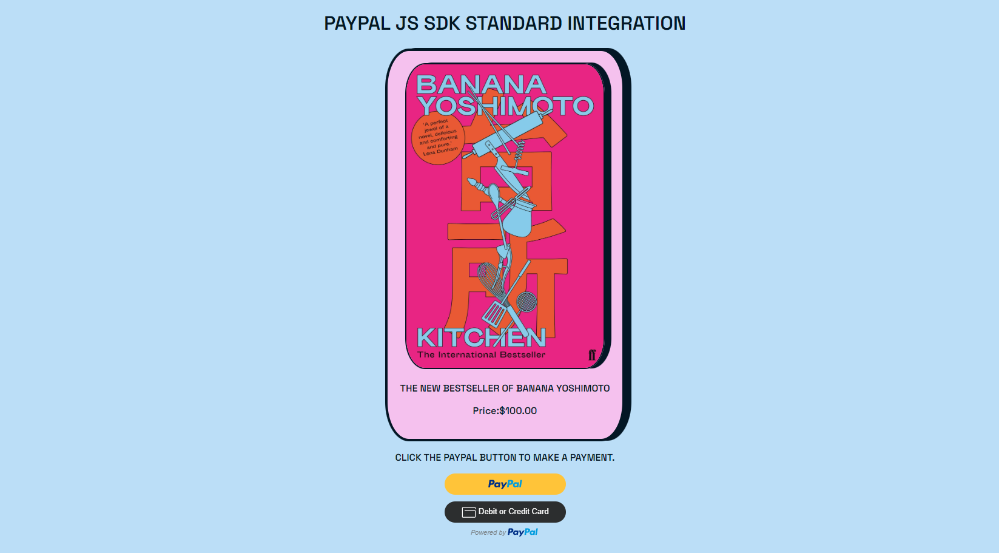

# PayPal JS SDK Integration Standard Checkout

Link to the deployed website:https://paypal-sdk-standard-351a5bf59fb1.herokuapp.com/

## Goals

I set up a PayPal JS SDK Integration of the Standard Checkout, for an interview at the company. 
This project allowed me to understand the process behind the PayPal Standard Checkout and how to implement it. 

## Technologies

- HTML/CSS
- Javascript
- Node.js
- Heroku

### Modules

- express : A minimalist framework, for Node.js, used to create a server and handle HTTP requests and responses.
- dotenv: A module that loads environment variables from a .env file into process.env. It's used to manage sensitive data like the PayPal client ID and secret.
- node-fetch: A module used to bring the fetch API to Node.js, to make requests to the PayPal API
- path: A Node.js module used to handle and transform file paths and used to serve the index.html file.

## Setup

The documentation for PayPal Standard Checkout is more than complete and will allow you to follow along while you're integrating it to your future projects.

Here's the link I used:

- https://developer.paypal.com/docs/checkout/standard/integrate/

You will also be provided a developer account once you sign up for Developers PayPal.

You will then have access to Sandbox accounts which will allow you to test your integration . 

## Deployment

To deploy this project, you first need to create a Heroku account. 

Once on the Heroku dashboard, create a new app.

You can then connect your Heroku app with your GitHub repository by using the Heroku CLI in your terminal or via the website. 

Make sure to add your environment variables (PAYPAL_CLIENT_ID and PAYPAL_CLIENT_SECRET) in the Settings sections of Heroku to be able to connect to the SDK once deployed.

## Notes

I left the different console.log present in the SDK setup to be able to track what's happening in the application, since it's a demonstration . 
However, in a real-life scenario, make sure to remove any console.log to avoid to display secret informations.

